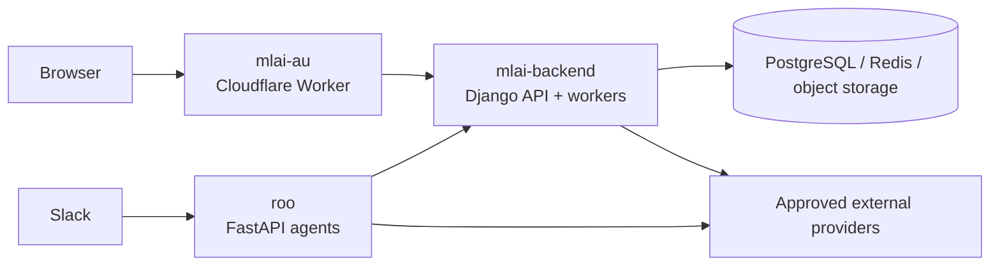

# Platform architecture

## Context

The supported MLAI platform currently consists of the public website and
browser applications, the shared Django backend, and Roo's Slack-facing agent
services. Each is independently deployable and has a distinct trust boundary.

The data node is conceptual: services do not necessarily share the same
database, cache, or object-storage instance. Never infer shared database access
from this diagram.

## Primary request paths

### Public website and product applications

The browser reaches the React Router application in `mlai-au`. Static and
server-rendered routes are handled by the Cloudflare Worker. Data-backed
features call explicit `mlai-backend` APIs. The browser must send credentials
only to approved origins.

### Slack and agents

Slack events reach Roo's FastAPI surface. Roo validates Slack requests, routes
intent, calls approved model or service providers, and performs only actions
allowed for its configured surface. Public Roo and Admin Roo must use distinct
credentials and authority.

## Trust boundaries

1. **Browser to public edge:** only explicitly configured origins receive
   browser credentials.
2. **Service to service:** each integration uses a dedicated credential and
   narrow contract rather than reusing browser credentials.
3. **External webhooks:** callers must be authenticated and replay-bounded.
4. **Public versus administrative agents:** authority and secrets remain
   separate even when behavior shares code.
5. **Data stores:** ownership is service-specific; direct cross-service database
   access is not implied.

## Data ownership

| Data | Authoritative service |
| --- | --- |
| MLAI users, organisations, founder tools, integrations | `mlai-backend` |
| Roo local receipts and agent-specific runtime state | `roo` |
| Website build content and browser-local prototype state | `mlai-au` |

When a feature needs data owned by another service, prefer an authenticated API
or event contract over direct database access.

## Inactive experiment architectures

`mlai-chat`, `mlai-plane`, and `mlai-plane-edge` explored deployment of the
open-source Buzz and Plane products. They are retained as inactive experiments,
not shown in the supported architecture diagram, and must not be treated as
current production request paths or data authorities.

Their repository-local architecture and runbook files describe intended
experimental behavior. Any reactivation requires an explicit architecture,
security, operations, and ownership review before those documents can be
promoted to current platform guidance.

## Architecture changes

Record a cross-repository architecture decision when changing ownership, a
public hostname, authentication, data authority, a service boundary, or rollout
ordering. Implementation details remain documented in the owning repository.
