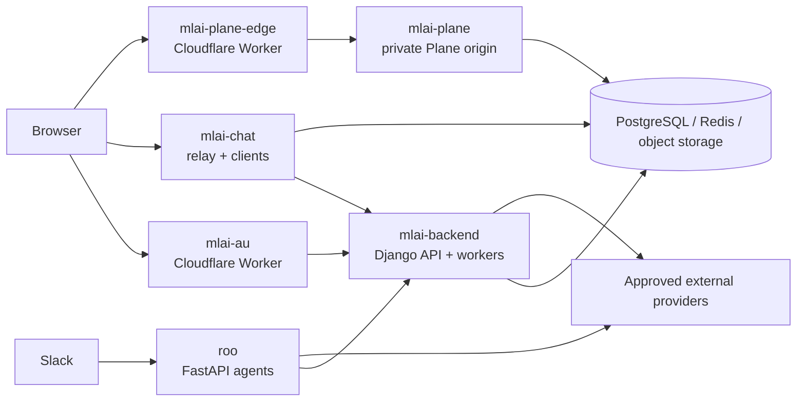

# Platform architecture

## Context

MLAI uses several independently deployable applications rather than one
monolith. The public website, Django backend, Slack agent, community workspace,
Plane application, and Plane edge gateway each have separate runtime and trust
boundaries.

The data node is conceptual: services do not necessarily share the same
database, cache, or object-storage instance. Never infer shared database access
from this diagram.

## Primary request paths

### Public website and product applications

The browser reaches the React Router application in `mlai-au`. Static and
server-rendered routes are handled by the Cloudflare Worker. Data-backed
features call explicit `mlai-backend` APIs. The browser must send credentials
only to approved origins.

### Community chat

MLAI Chat clients connect to the `mlai-chat` relay. The relay owns chat event
storage and protocol behavior. `mlai-backend` supplies selected MLAI account,
membership, email-code, and bridge integration contracts; it is not the chat
event store.

### Slack and agents

Slack events reach Roo's FastAPI surface. Roo validates Slack requests, routes
intent, calls approved model or service providers, and performs only actions
allowed for its configured surface. Public Roo and Admin Roo must use distinct
credentials and authority.

### Plane administration

The browser reaches `admin.mlai.au` through `mlai-plane-edge`. The edge Worker
removes MLAI parent-domain authentication cookies, supplies private-origin
credentials, and proxies to `mlai-plane`. Plane authentication remains
separate from the MLAI website session.

## Trust boundaries

1. **Browser to public edge:** only explicitly configured origins receive
   browser credentials.
2. **`admin.mlai.au` to Plane:** MLAI parent-domain cookies are denied; Plane
   cookies remain host-local.
3. **Service to service:** each integration uses a dedicated credential and
   narrow contract rather than reusing browser credentials.
4. **External webhooks:** callers must be authenticated and replay-bounded.
5. **Public versus administrative agents:** authority and secrets remain
   separate even when behavior shares code.
6. **Data stores:** ownership is service-specific; direct cross-service database
   access is not implied.

## Data ownership

| Data | Authoritative service |
| --- | --- |
| MLAI users, organisations, founder tools, integrations | `mlai-backend` |
| Chat events, channels, chat audit state | `mlai-chat` |
| Plane work items and Plane configuration | `mlai-plane` |
| Roo local receipts and agent-specific runtime state | `roo` |
| Website build content and browser-local prototype state | `mlai-au` |

When a feature needs data owned by another service, prefer an authenticated API
or event contract over direct database access.

## Architecture changes

Record a cross-repository architecture decision when changing ownership, a
public hostname, authentication, data authority, a service boundary, or rollout
ordering. Implementation details remain documented in the owning repository.
